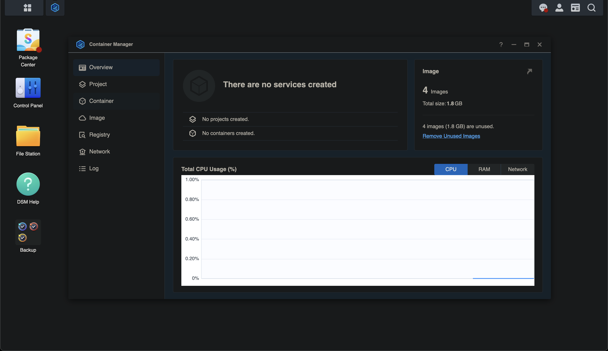
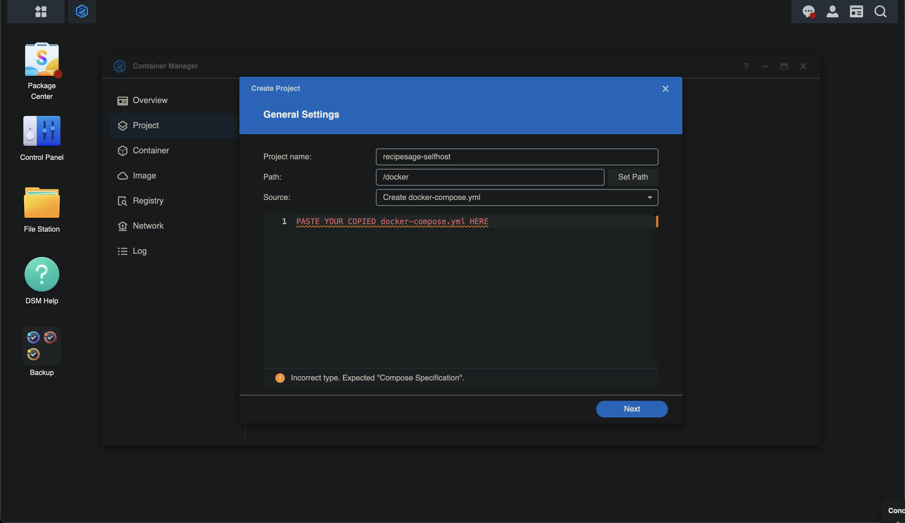
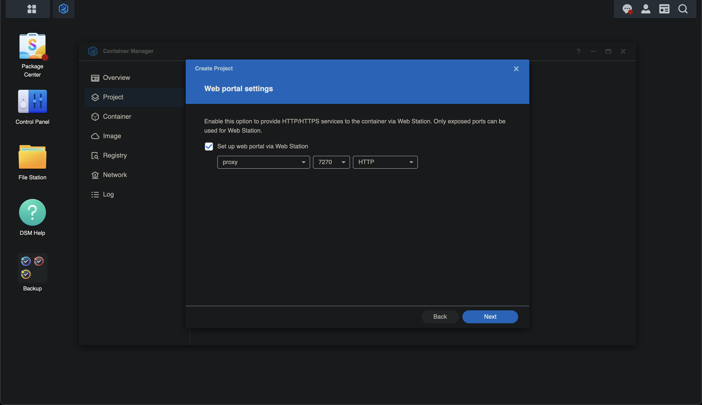
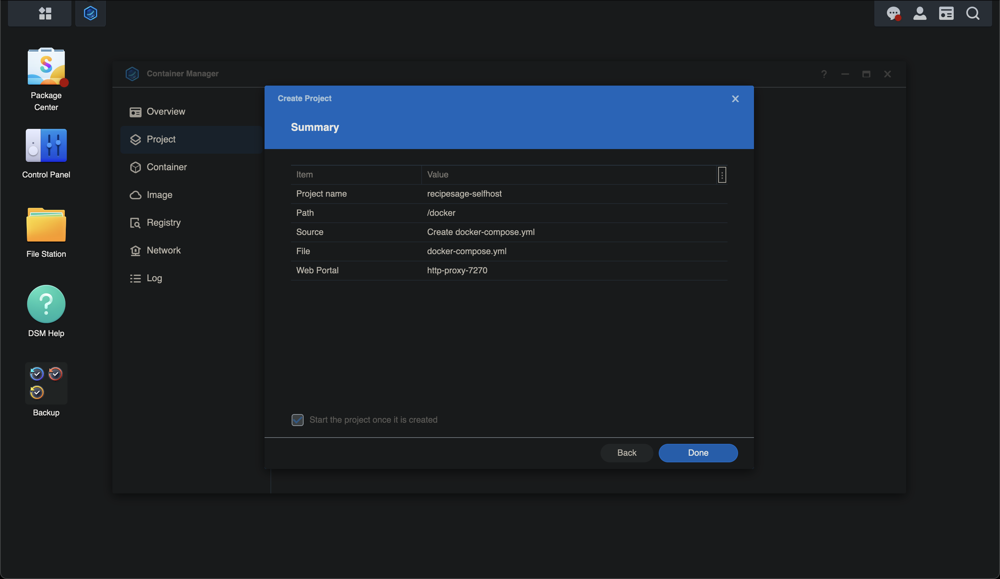
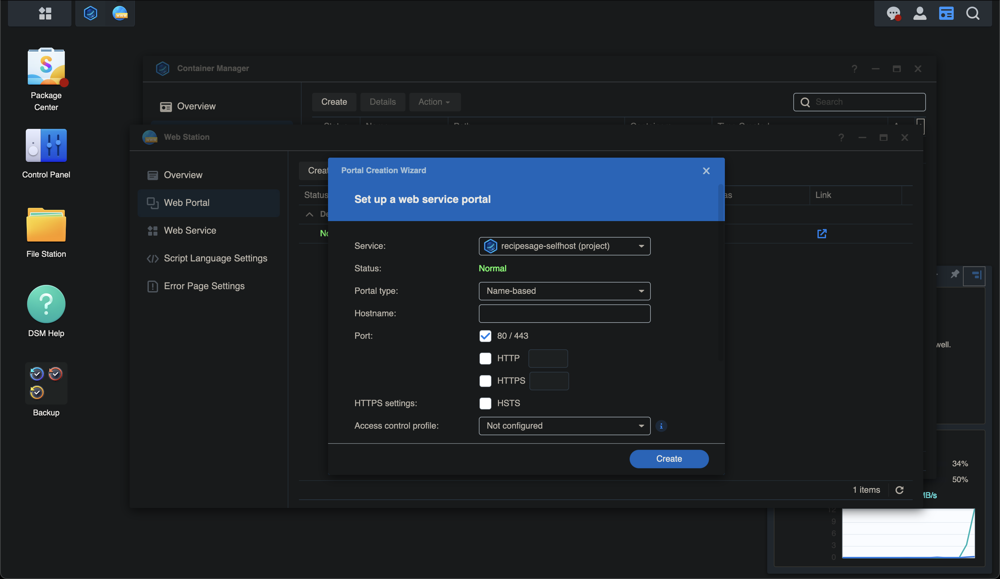
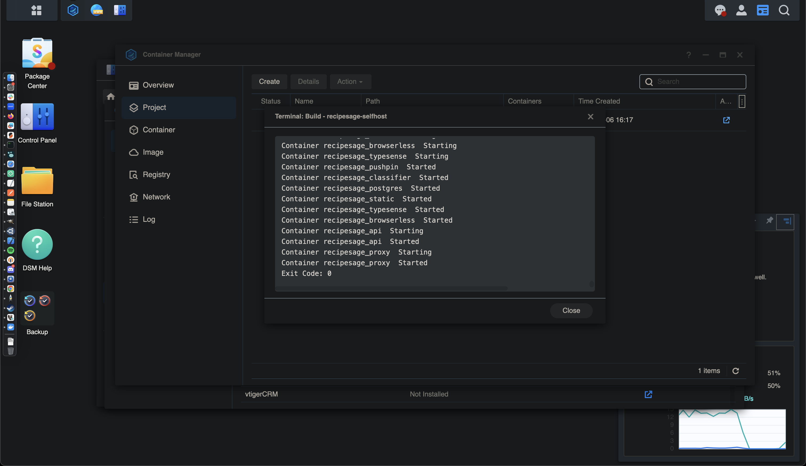

# Synology Setup Guide

These steps are specific to setting up RecipeSage on a Synology box. Please follow the normal setup instructions for non-Synology based installs.

## Prerequisites

- Version 7.2 of DSM running on your Synology NAS.
- The package `Container Manager` installed via the `Package Center` application on your Synology NAS.

## Step 1

Copy the RecipeSage docker-compose.yml file [from here](https://raw.githubusercontent.com/julianpoy/RecipeSage-selfhost/main/docker-compose.yml).

## Step 2

Open your Synology WebUI, and navigate to the `Container Manager` application via the applications menu.

## Step 3

Switch to the project tab in the left sidebar of the `Container Manager`.

Create a project either using the "create" button, and enter the corresponding details (as shown below) into the create project dialogue.

**Note** that you'll paste in the docker-compose.yml file that you copied above into this dialogue.

Click next.

## Step 4

On the next page, you'll be presented with a dialogue asking if you want to provide web services to the created containers. You'll want to enable HTTP on port 7270 to the proxy container as shown below.

Click next.

## Step 5

On the next page, you'll be shown a summary of what you've configured. It should match the image below.

If all looks correct, you can click done.

## Step 6

At this point you may see a few modals pop up. One should be showing you the download & extracting progress for all of the RecipeSage containers. You'll also see a prompt like below regarding the web service configuration.

Leave all of the settings default, but fill in the hostname field with the domain name you'd like to use for RecipeSage if you have one, such as (recipesage.yourdomain.com). If not, and you're just planning to use RecipeSage within your local network, just enter `recipesage` into this field and click the create button.

## Step 7

Once the download & extracting progress window has completed, you should see text in that window similar to the following.

You can press the done button.

## Step 8

Navigate to http://YOUR_SYNOLOGY_IP_ADDRESS:7270 in your web browser, and you should see the RecipeSage interface!

## Further Steps

These steps are very well documented across the internet, and I recommend Googling for help here if you are unfamiliar with these concepts. Please do not open issues related to the following steps.

If you entered a domain name for RecipeSage in step 6, you'll want to:

- Follow [Synology's guide for getting an HTTPS certificate](https://kb.synology.com/en-my/DSM/tutorial/How_to_enable_HTTPS_and_create_a_certificate_signing_request_on_your_Synology_NAS) if you don't have a certificate for this domain name already configured. You can manage certificates and their assignments within `Control Panel -> Security -> Certificate`.
- Port forward port 80 & 443 via your router to your Synology box. (Google the model of your router for instructions for how to do this)
- Follow [Synology's guide for setting up DDNS for your domain](https://kb.synology.com/en-us/DSM/help/DSM/AdminCenter/connection_ddns?version=7)

If you've followed all of the steps above, you should be able to access RecipeSage via the domain you configured.

## Updating

First, check any notes regarding the new version you'll be updating to [here](https://github.com/julianpoy/recipesage-selfhost#changelog) since there may be additional steps required.

To update your copy of RecipeSage on your Synology NAS, first stop RecipeSage via the `Container Manager -> Project` interface.

After all of the associated RecipeSage containers stop, navigate to the `YAML Configurations` tab within the RecipeSage project you set up.

Copy the latest docker-compose.yaml from here [from here](https://raw.githubusercontent.com/julianpoy/RecipeSage-selfhost/main/docker-compose.yml), and replace the content of the `YAML Configurations` window with the content of the new docker-compose.yml file.

Click Save and select `Build and start the project (rebuild the image)`.

RecipeSage should be updated. Again, please perform any additional steps described [here](https://github.com/julianpoy/recipesage-selfhost#changelog) if required.

